# 9월 8일 Quick 코멘트 분석

> 2026-09-08. Quick 코멘트(06:18~15:09) + 첨부 PDF 10개. HTML: `reports/2026-09-08-quick-comment-brief.html`

매수·매도 권유가 아닙니다.

페이지 그림:

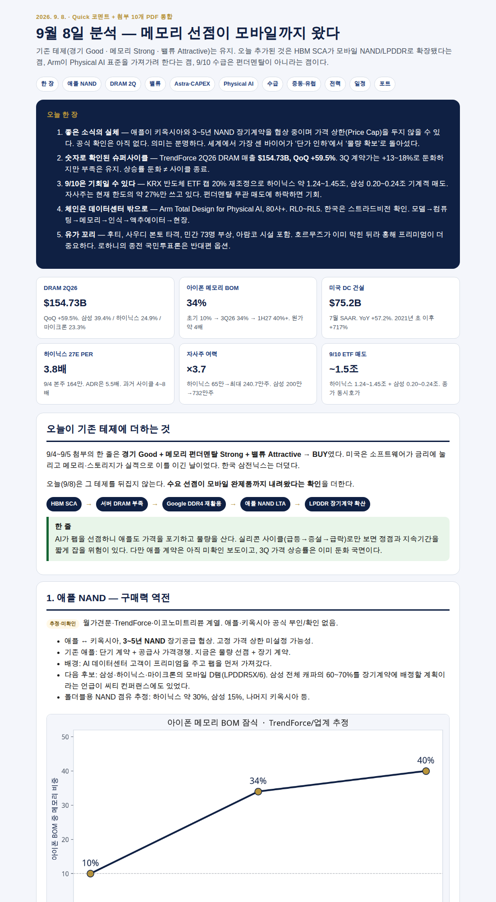

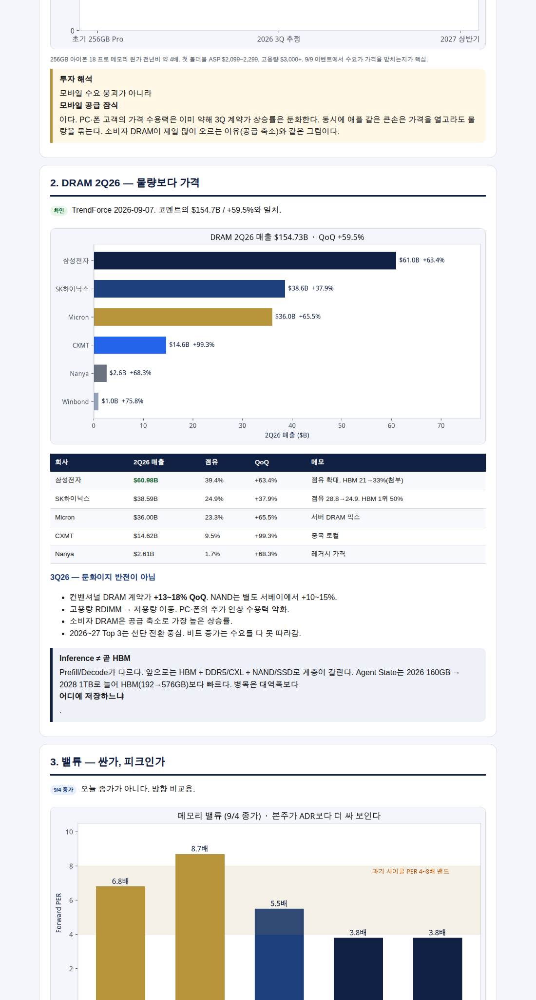

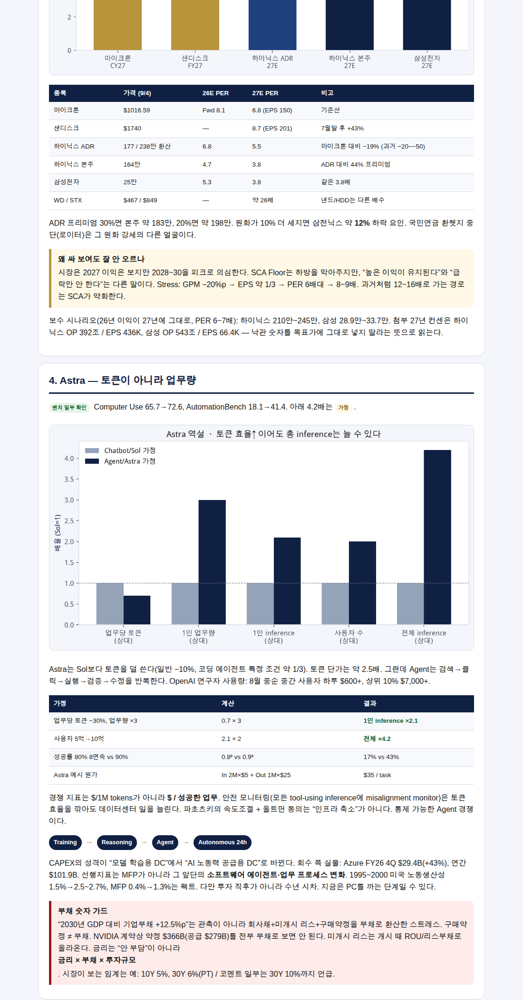

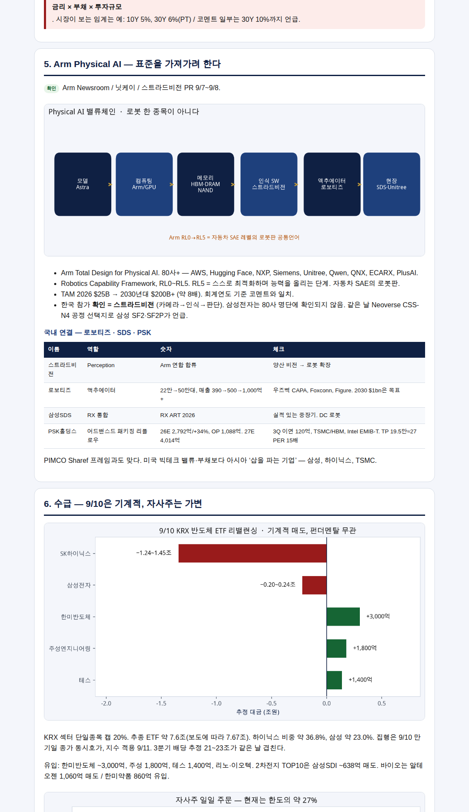

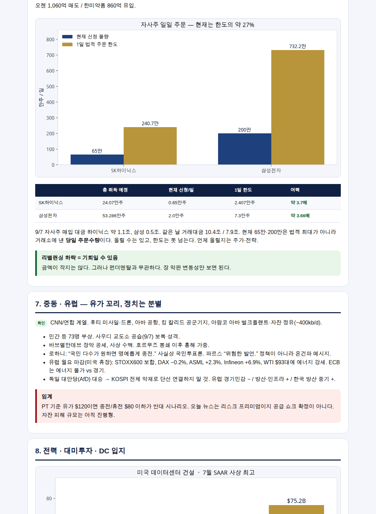

## 한 줄

애플이 가격 상한 없는 3~5년 NAND를 논의한다는 보도는, AI가 팹을 선점하자 세계 최강 바이어마저 물량으로 돌아섰다는 뜻이다. 2Q DRAM $154.73B(+59.5%)가 그 실물이다. 9/10 ETF 매도(하이닉스 1.24~1.45조)는 펀더멘탈이 아니다.

## 오늘이 더하는 것

기존 테제(9/4~5): **경기 Good + 메모리 Strong + 밸류 Attractive**.  
오늘: HBM SCA → 서버 DRAM 부족 → Google DDR4 재활용 → **애플 NAND LTA** → LPDDR 장기계약 확산.

## 1. 애플 NAND (미확인 보도)

- 키옥시아와 3~5년, Price Cap 없을 수 있음. 공식 확인 없음.
- 아이폰 18 프로 256GB 메모리 원가 약 4배, BOM 10% → 34% → 1H27 40%+.
- 폴더블 ASP $2,099~2,299, 고용량 $3,000+.
- 삼성 캐파 60~70% LTA. 폴더블 NAND 하이닉스 30% / 삼성 15%.
- 9/9 이벤트: 가격을 올려도 수요가 받치는가.

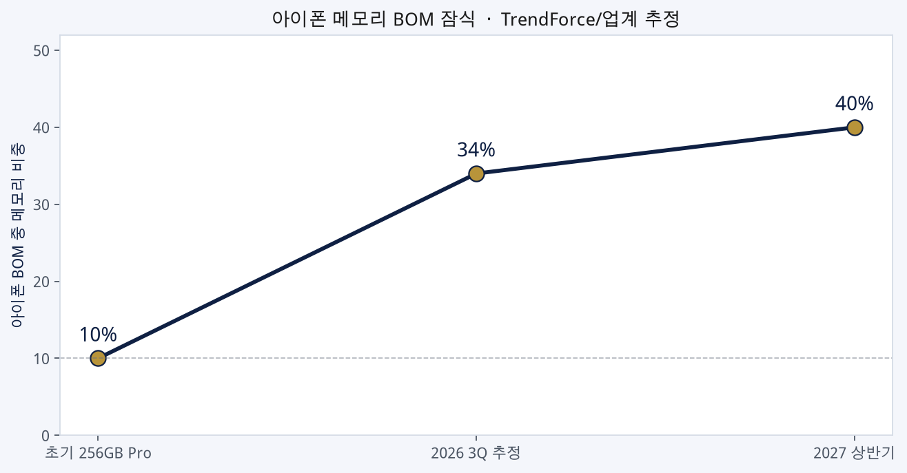

## 2. DRAM 2Q26 (TrendForce 확인)

| 회사 | 매출 | 점유 | QoQ |
|---|---:|---:|---:|
| 삼성전자 | $60.98B | 39.4% | +63.4% |
| SK하이닉스 | $38.59B | 24.9% | +37.9% |
| Micron | $36.00B | 23.3% | +65.5% |
| CXMT | $14.62B | 9.5% | +99.3% |

3Q 계약가 +13~18%. 상승률 둔화 ≠ 종료. 소비자 DRAM이 제일 많이 오른다(공급 축소). Inference를 HBM과 등치하지 말 것.

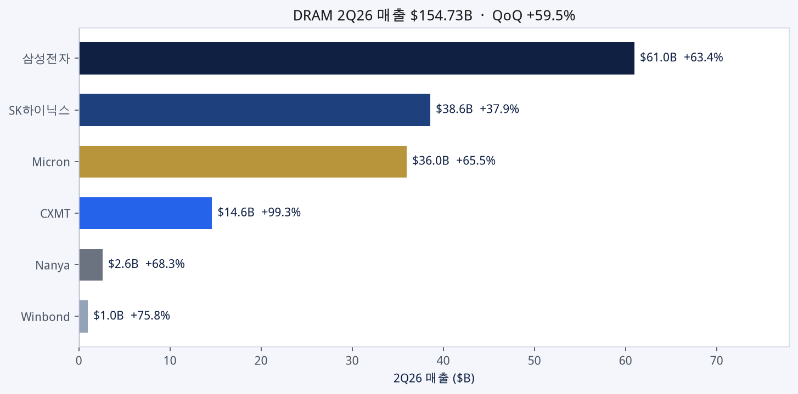

## 3. 밸류 (9/4)

하이닉스 본주 3.8배 / 삼성 3.8배 / 마이크론 6.8배 / ADR 프리미엄 44%. 원화 +10% ≈ 주식 −12%. 국민연금 환헷지 중단은 그 배경. 시장 질문: 2027 EPS가 피크인가.

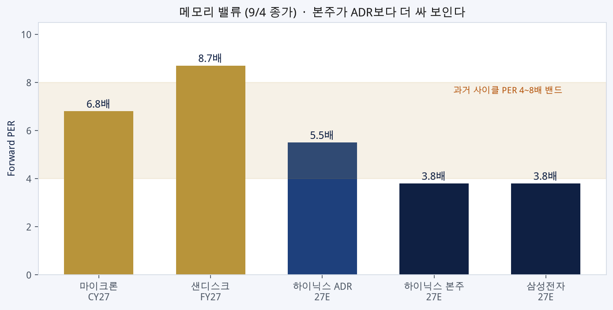

## 4. Astra · CAPEX · 부채

토큰 효율 −30% × 업무 ×3 = 1인 ×2.1. 사용자 ×2 → 전체 ×4.2 (**가정**). 지표는 Cost per Task Successfully Completed. 80%⁸=17% vs 90%⁸=43%. 안전 모니터링은 compute를 더 쓴다.

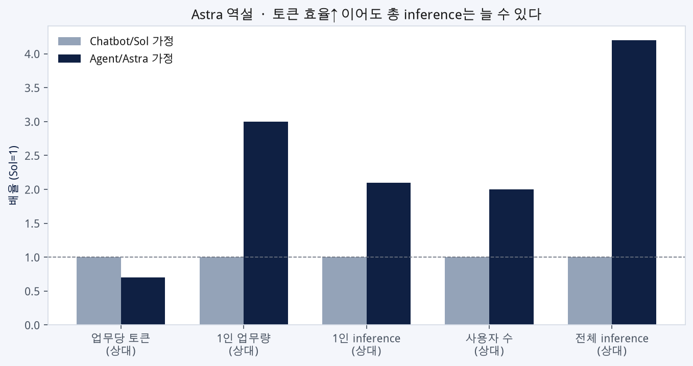

+12.5%p 기업부채는 스트레스이지 예상치가 아니다. 구매약정 ≠ 부채. NVIDIA $366B 약정도 부채가 아니다.

Azure FY26 $101.9B, 4Q +43%. 1990년대: 생산성 1.5%→2.5~2.7%, MFP 0.4%→1.3%. 시차 있음. 지금은 PC 설치 단계일 수 있다.

## 5. Physical AI

Arm 80사+, TAM $25B→$200B, RL0~RL5. 한국 확인 = **스트라드비전**. 삼성전자는 명단 미확인, SF2/SF2P는 Neoverse 언급. 로보티즈 액추에이터 22만→50만. SDS RX. PSK 26E 매출 2,792억 OPM 39%, TP 19.5만.

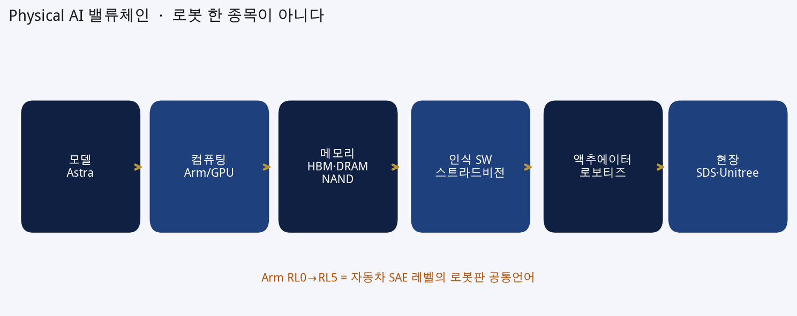

## 6. 수급

9/10 하이닉스 ETF −1.24~1.45조, 삼성 −0.20~0.24조. 한미 +3,000억. 자사주 현재/한도 = 65만/240.7만, 200만/732만. 9/7 매입 1.1조+0.5조, 거래대금 10.4조/7.9조. 65만·200만은 고정 방어가 아니다.

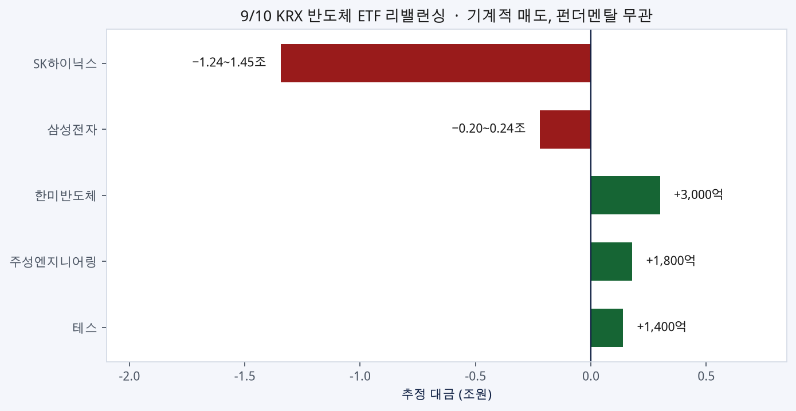
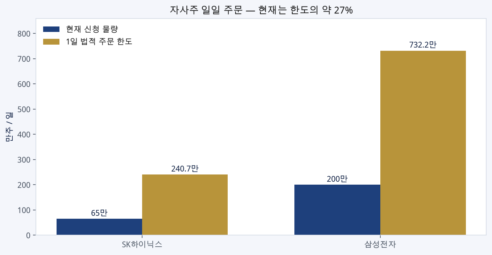

## 7. 중동 · 유럽

후티→사우디, 부상 73, 아람코 자잔. 로하니 종전 국민투표론(강경파 반발). 유럽 보합, ASML +2.3%, Infineon +6.9%. AfD ≠ KOSPI 전체 악재.

## 8. 전력

DC 건설 7월 $75.2B SAAR, YoY +57.2%. 엔시날 6.3GW / $22.3B, 9/7 의결 보도, 9/18 발표 가능. 원전 8기는 검토. DeepSeek 화웨이 16만장 $2.56B는 잠재수요, 납기 1년+.

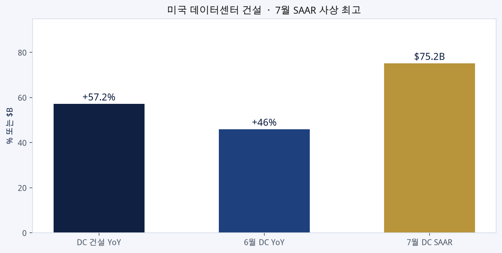

## 9. 일정

9/9 Apple · 9/10 Oracle + Nvidia GS + PPI + 만기/리밸런싱 · 9/11 CPI · 9/18 엔시날.

Hartnett −10%: 스윕 단독이 아니라 10Y 5%+CAPEX 둔화+수익화 실망이 겹칠 때.

## 10. 규칙

AI 40~50 / Non-AI 20~30 / 현금 30. 임계: 10Y 5%, 유가 $120, CAPEX 증가율. 9/10 종가 급락을 펀더멘탈로 읽지 말 것.
