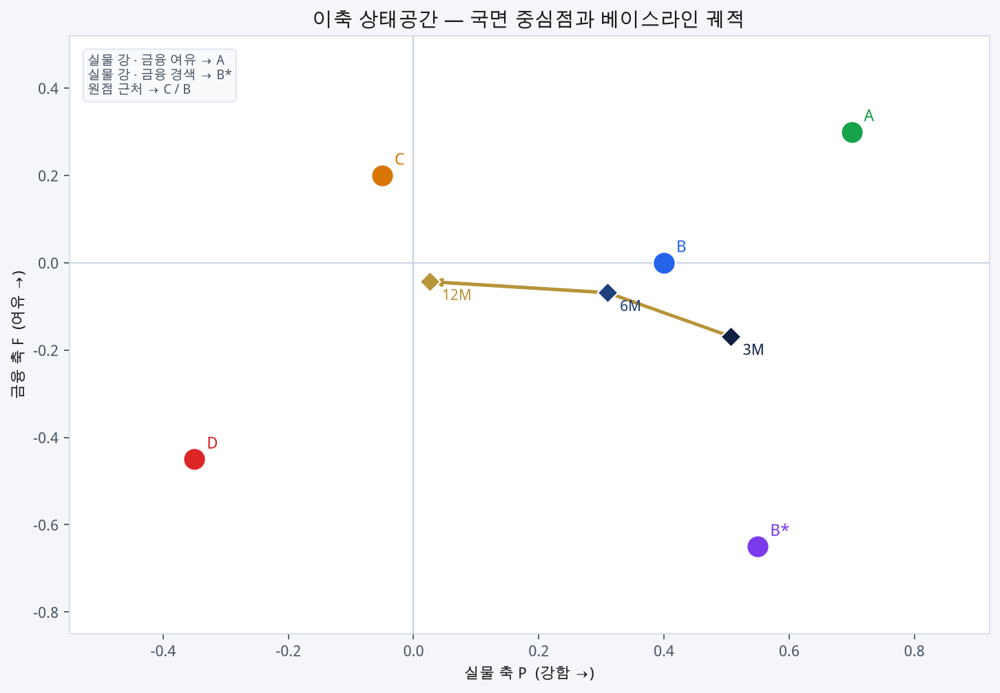
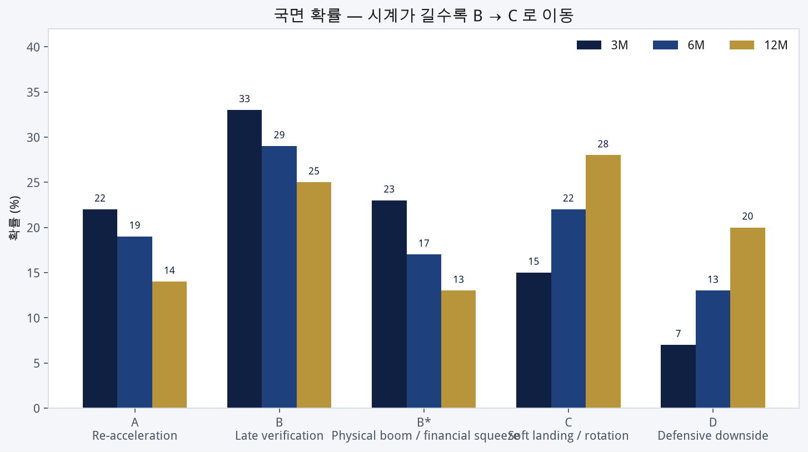
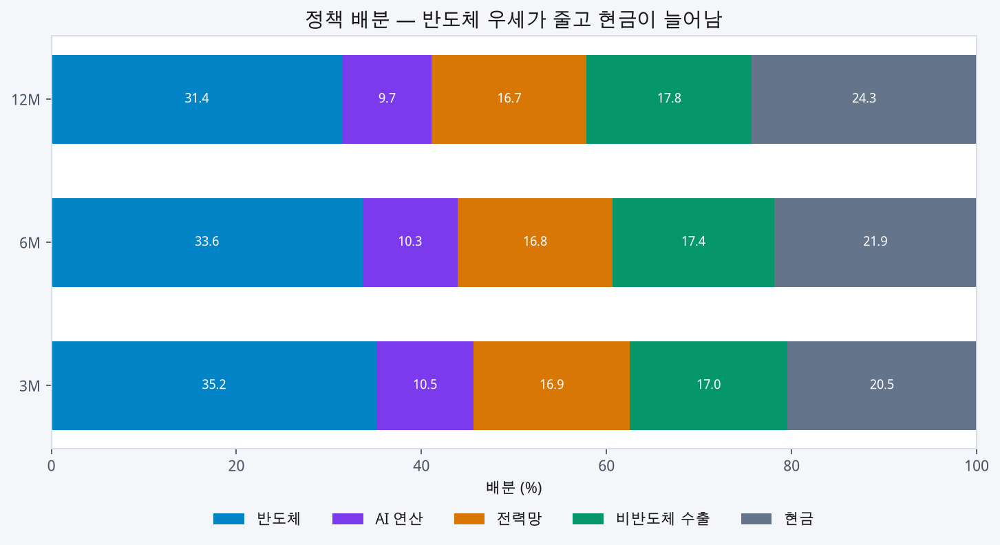
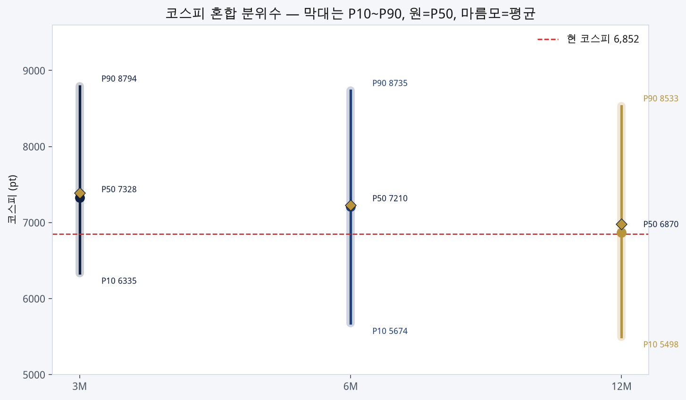
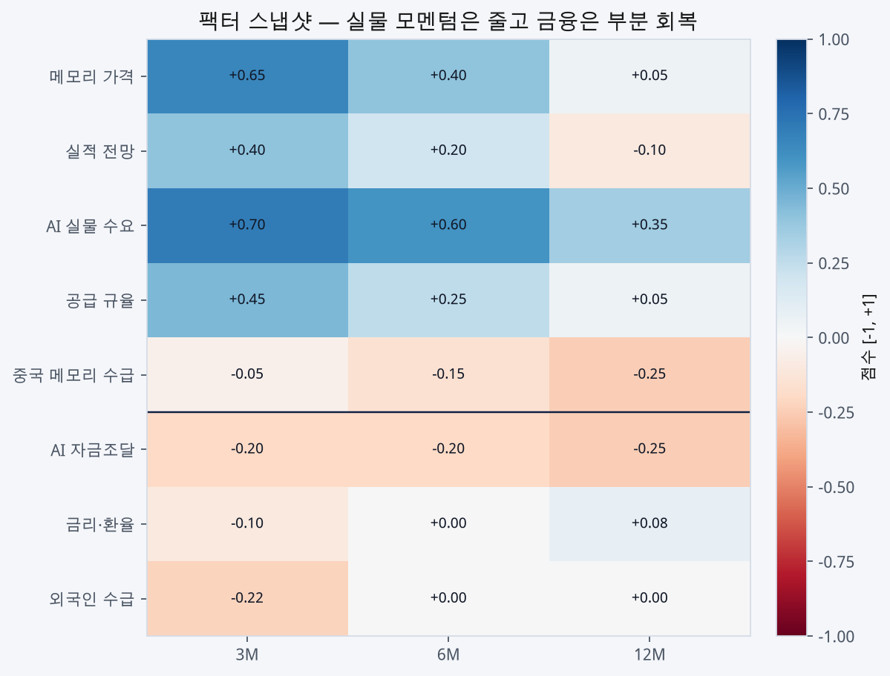
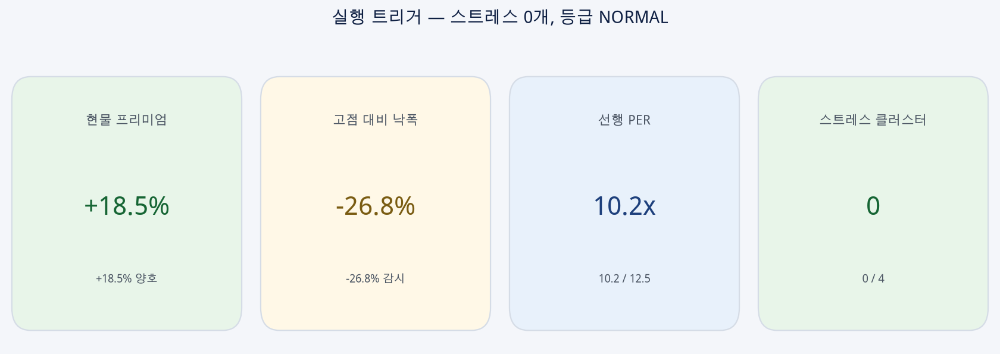

# 패널 합성 국면 모델 — 베이스라인 결과

**2026-08-21** · 3M / 6M / 12M 소프트맥스 국면 · 코스피 혼합 분위수 · 클러스터 실행 점검

투자 참고용 · 투자 권유 아님 · 배분 변경은 사람 검토 필요

## 한 줄 결론

3개월은 **후기검증(B) 33%**가 1위다. 시계를 1년으로 늘리면 **연착륙·순환(C) 28%**가 1위가 된다. 실행 등급은 **NORMAL**. DDR5 현물 프리미엄 **+18.5%**가 메모리 스트레스를 차단했고, 코스피 **6,852**는 12개월 혼합분포 중앙값(6,870)과 거의 같다.

## KPI

| 항목 | 값 | 읽기 |
|---|---|---|
| 3M 상태벡터 | P **+0.507** / F **-0.169** | 실물은 강한데 금융은 살짝 눌림 |
| 6M 상태벡터 | P **+0.310** / F **-0.069** | 실물 모멘텀 완화 |
| 12M 상태벡터 | P **+0.026** / F **-0.043** | 원점 근처, 순환 구간 |
| 주도 국면 | 3M **B 33%** · 6M **B 29%** · 12M **C 28%** | 시계가 길수록 B → C |
| 실행 트리거 | **NORMAL** | 스트레스 클러스터 0개 |
| 현물 프리미엄 | **+18.5%** | 52.73 / 44.50, DDR5 16Gb |
| 코스피 낙폭 | **-26.8%** | 6,852 / 고점 9,360 |
| 선행 PER | **10.2 / 12.5** | 천장 아래 |

## 1. 상태공간 궤적

실물(P)은 3개월 +0.51에서 12개월 +0.03으로 빠지고, 금융(F)은 −0.17에서 −0.04로 조금 회복한다. 점은 A/B 사이(3M)에서 C 쪽으로 미끄러진다.

| 시계 | P | F | 1위 | 2위 | 3위 |
|---|---:|---:|---|---|---|
| 3M | +0.507 | -0.169 | B 33% | B* 23% | A 22% |
| 6M | +0.310 | -0.069 | B 29% | C 22% | A 19% |
| 12M | +0.026 | -0.043 | C 28% | B 25% | D 20% |

## 2. 국면 확률

| 국면 | 이름 | 3M | 6M | 12M |
|---|---|---:|---:|---:|
| A | A: Re-acceleration (재가속) | 22% | 19% | 14% |
| B | B: Late verification (후기검증) | 33% | 29% | 25% |
| B* | B*: Physical boom / financial squeeze (실물호황·신용경색) | 23% | 17% | 13% |
| C | C: Soft landing / rotation (연착륙·순환) | 15% | 22% | 28% |
| D | D: Defensive downside (방어) | 7% | 13% | 20% |

A(재가속)는 22→14%, D(방어)는 7→20%. 단기 낙관과 장기 방어가 동시에 섞인다.

## 3. 정책 배분

확률가중 정책이다. 자동 리밸런싱이 아니다.

| 자산 | 3M | 6M | 12M |
|---|---:|---:|---:|
| 반도체 | 35.2% | 33.6% | 31.4% |
| AI 연산 | 10.5% | 10.3% | 9.7% |
| 전력망 | 16.9% | 16.8% | 16.7% |
| 비반도체 수출 | 17.0% | 17.4% | 17.8% |
| 현금 | 20.5% | 21.9% | 24.3% |

반도체 35.2%→31.4%, 현금 20.5%→24.3%. 전력망·비반도체 수출은 거의 고정이다.

## 4. 코스피 혼합 분위수

각 국면 앵커 밴드를 균등분포로 보고, 국면 확률로 섞은 뒤 분위수를 이분 탐색했다.

| 항목 | 3M | 6M | 12M |
|---|---:|---:|---:|
| 평균 | 7,388 | 7,227 | 6,981 |
| P10 | 6,335 | 5,674 | 5,498 |
| P50 | 7,328 | 7,210 | 6,870 |
| P90 | 8,794 | 8,735 | 8,533 |

현 6,852 기준:

- 3M 평균까지 **+7.8%**, P10 **-7.6%**, P90 **+28.3%**
- 12M P50(6,870) 대비 **-0.3%** — 현재 레벨이 1년 중앙값에 붙어 있다

국면 앵커(전 시계 동일): A 8,200–9,300 · B 7,200–8,100 · B* 6,400–7,300 · C 6,200–7,000 · D 5,200–5,800

## 5. 팩터

| 팩터 | 3M | 6M | 12M |
|---|---:|---:|---:|
| 메모리 가격 | +0.65 | +0.40 | +0.05 |
| 실적 전망 | +0.40 | +0.20 | -0.10 |
| AI 실물 수요 | +0.70 | +0.60 | +0.35 |
| 공급 규율 | +0.45 | +0.25 | +0.05 |
| 중국 메모리 수급 | -0.05 | -0.15 | -0.25 |
| AI 자금조달 | -0.20 | -0.20 | -0.25 |
| 금리·환율 | -0.10 | +0.00 | +0.08 |
| 외국인 수급 | -0.22 | +0.00 | +0.00 |

실물(메모리·AI 수요·공급 규율)은 시계가 길수록 빠지고, 중국 수급은 더 음수다. 금융은 금리·환율과 외국인 수급이 회복되고, AI 자금조달만 −0.20 → −0.25로 남는다.

## 6. 실행 리스크

**등급: NORMAL** · 활성 클러스터 없음

| 점검 | 값 | 임계 | 결과 |
|---|---|---|---|
| DDR5 16Gb 현·선 스프레드 | +18.5% (52.73 vs 44.50) | ≤0% 스트레스, ≤5% 감시 | 양호 |
| 실적 전망 | +0.40 | 스프레드≤0 이고 ≤−0.25면 memory | 미발동 |
| AI 자금조달 | -0.20 | ≤−0.50 | 미발동 |
| 금리·환율 + 외국인 | 평균 -0.16 | ≤−0.40 | 미발동 |
| 선행 PER | 10.2 | 천장 12.5 | 미발동 |
| 코스피 낙폭 | -26.8% | ≤−40% 딥 드로우다운 | 감시 문구만 |

엔진 메시지:

- ✅ Comparable spot premium is positive (+18.5%).
- KOSPI drawdown from rolling high: -26.8%.
- Decision rule: Allocation adjustment requires human review.

## 의사결정 규칙

배분 숫자는 국면 확률의 가중 평균이다. **자동 매매·자동 리밸런싱 신호가 아니다.** 할당 조정은 사람 검토가 필요하다.

관측일: 현물 2026-08-14, 계약 2026-07-31, 갭 14일(비교 가능). 코스피 6,852 / 롤링 고점 9,360.
